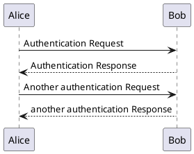

# docsify-kroki


## Install

1. Insert script into docsify document:

```html
<script src="//unpkg.com/docsify-kroki"></script>
```

## Usage

````markdown
#Demo

## embedding it directly




## load from external files


````

## Options

```html
<script>
window.$docsify = {
  // default
  kroki: {
    langs: [
      "plantuml",
      "mermaid",
      "svgbob",
      "vega",
      "vegalite",
      "wavedrom",
      "nomnoml",
      "graphviz",
      "erd",
      "ditaa",
      "c4plantuml",
      "packetdiag",
      "nwdiag",
      "actdiag",
      "seqdiag",
      "bytefield",
      "bpmn",
      "blockdiag",
      "rackdiag",
      "pikchr",
      "excalidraw",
    ],
    // default
    serverPath: "//kroki.io/",
  },
}
</script>
```

### langs

By default, those markdown language render by kroki:
`plantuml`,`mermaid`,`svgbob`,`vega`,`vegalite`,`wavedrom`,`nomnoml`,`graphviz`,`erd`,`ditaa`,`c4plantuml`,`packetdiag`,`nwdiag`,`actdiag`,`seqdiag`,`bytefield`,`bpmn`,`blockdiag`,`rackdiag`,`pikchr`,`excalidraw`,
you can add more to langs array.

### serverPath

By default, the official Kroki server is used. If you have your own, configure
it using the `serverPath` option:

## Example

- [index.html](docs/index.html)
