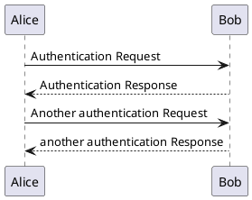

# docsify-kroki

[](https://www.npmjs.com/package/docsify-kroki)
[](https://codecov.io/gh/zuisong/docsify-kroki)

[](https://bundlephobia.com/package/docsify-kroki)
[](https://bundlephobia.com/package/docsify-kroki)

[](https://github.com/zuisong/docsify-kroki/commits/main)
[](https://npmtrends.com/docsify-kroki)

## Install

1. Insert script into docsify document:

```html
<script src="//unpkg.com/docsify-kroki"></script>
```

## Usage

````markdown
#Demo

## embedding it directly




## load from external files


````

## Options

```html
<script>
window.$docsify = {
  // default
  kroki: {
    langs: [
      "actdiag",
      "blockdiag",
      "bpmn",
      "bytefield",
      "c4plantuml",
      "d2",
      "dbml",
      "ditaa",
      "erd",
      "excalidraw",
      "graphviz",
      "mermaid",
      "nomnoml",
      "nwdiag",
      "packetdiag",
      "pikchr",
      "plantuml",
      "rackdiag",
      "seqdiag",
      "structurizr",
      "svgbob",
      "symbolator",
      "tikz",
      "vega",
      "vegalite",
      "wavedrom",
      "wireviz",
    ],
    // default
    serverPath: "//kroki.io/",
  },
}
</script>
```

### langs

By default, those markdown language render by kroki:

|            |              |            |             |               |
| ---------- | ------------ | ---------- | ----------- | ------------- |
| `actdiag`  | `blockdiag`  | `bpmn`     | `bytefield` | `c4plantuml`  |
| `d2`       | `dbml`       | `ditaa`    | `erd`       | `excalidraw`  |
| `graphviz` | `mermaid`    | `nomnoml`  | `nwdiag`    | `packetdiag`  |
| `pikchr`   | `plantuml`   | `rackdiag` | `seqdiag`   | `structurizr` |
| `svgbob`   | `symbolator` | `tikz`     | `vega`      | `vegalite`    |
| `wavedrom` | `wireviz`    |            |             |               |

you can add more to langs array.

### serverPath

By default, the official Kroki server is used. If you have your own, configure
it using the `serverPath` option:

## Example

- [index.html](docs/index.html)
