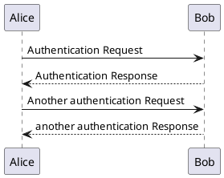

# docsify-kroki

## Install

1. Insert script into docsify document:

```html
    <script src="//unpkg.com/docsify-kroki"></script>
```

## Usage

````markdown
### Section X

````

````markdown
### Section X

````

## Options

## serverPath

By default, the official Kroki server is used. If you have your own, configure it using the `serverPath` option:

```html
<script>
window.$docsify = {
  kroki: {
    // default
    serverPath: '//kroki.io/',
  },
}
</script>
```

## Example

- [index.html](docs/index.html)
