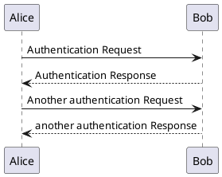

# docsify-kroki

## Install

1. Configure docsify-kroki (optional):

    ```html
    <script>
    window.$docsify = {
      kroki: {
        // default setting
        langs:  [
          "plantuml",
          "mermaid",
          "svgbob",
          "vega",
          "vegalite",
          "wavedrom",
          "nomnoml",
          "graphviz",
          "erd",
          "ditaa",
          "c4plantuml",
          "packetdiag",
          "nwdiag",
          "actdiag",
          "seqdiag",
          "bytefield",
          "bpmn",
          "blockdiag",
          "rackdiag",
        ],
      },
    }
    </script>
    ```

    See [Options](#Options) for more details.

2. Insert script into docsify document:

    ```html
    <script src="//unpkg.com/docsify-kroki"></script>
    ```


## Usage

Write your plantuml code into a code block marked ``plantuml`` or ``mermaid``:

````markdown
### Section X

````

````markdown
### Section X

````


## Options

## serverPath
By default, the official PlantUML server is used. If you have your own, configure it using the `serverPath` option:

```html
<script>
window.$docsify = {
  kroki: {
    // default
    serverPath: '//kroki.io/',
  },
}
</script>
```


## Example

- [index.html](example/index.html)
