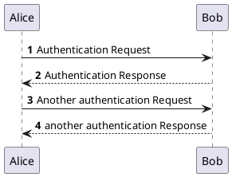

# Example

# Basic 1
```plantuml
:一级: -right-*  :二级: 
```

## Basic 2



---
```plantuml
skinparam monochrome true
skinparam ranksep 20
skinparam dpi 150
skinparam arrowThickness 0.7
skinparam packageTitleAlignment left
skinparam usecaseBorderThickness 0.4
skinparam defaultFontSize 12
skinparam rectangleBorderThickness 1

rectangle "Main" {
  (main.view)
  (singleton)
}
rectangle "Base" {
  (base.component)
  (component)
  (model)
}
rectangle "<b>main.ts</b>" as main_ts

(component) ..> (base.component)
main_ts ==> (main.view)
(main.view) --> (component)
(main.view) ...> (singleton)
(singleton) ---> (model)
```
